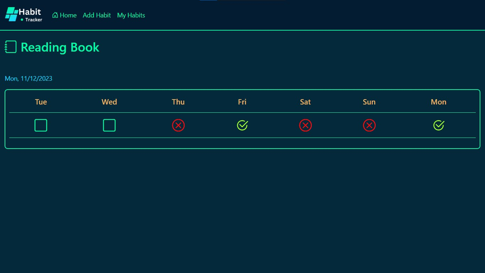

# Habit Tracker Application

The Habit Tracker is an application developed using the MVC architecture with Node.js, Express.js, MongoDB as the database, and Mongoose as the ODM tool. It allows users to manage and track their habits effectively by adding multiple habits to a list, viewing the list, and inspecting the record of any habit for the last 7 days. Users can update the status of any habit for each day as 'None', 'Not Done', or 'Done'.

## Steps to Setup

1. Clone the repository
2. Install dependencies
3. Run the server from the index.js file 
3. The server will start listening on port 5100.

## Project Structure

- **index.js**: Main file to start the Express server.

- **configurations/mongoose.config.js**: Configuration file to connect to the MongoDB database.

- **src/controller/habit.controller.js**: Handling all the routing-related operations.

- **src/model/habit.model.js**: Handling all the database-related operations.
- **src/model/habit.schema.js**: Mongoose schema defining the structure of the habit model.

- **src/view/css/globalStyle.css**:This file contains the styles for all the pages.

- **src/view/html/add-habit-page.ejs**:This file represents the page from where the user can add new habits.
- **src/view/html/error.ejs**:The user will see this page if any error is found on the server.
- **src/view/html/habit-list-page.ejs**:This page represents the list of all the habits added by the user.
- **src/view/html/home-page.ejs**:This page represents the home page of the application.
- **src/view/html/layout.ejs**:This page represents the layout file of every page.
- **src/view/html/record-page.ejs**:This page represents the 7-day record for each habit.

- **src/view/script/record-page.js**:This page represents the script file for the record-page file.

- **src/view/images**:This contains all the images used in the application.

## Screenshots

### Home Page

### Add Habit Page

### Habit List Page

### Record Page

## Dependencies

- **Express**: Web application framework for Node.js.
- **ejs**: Embedded JavaScript templates for rendering views
- **Mongoose**: MongoDB object modeling tool designed to work in an asynchronous environment.
- **express-ejs-layouts**:  Layout support for EJS templates in Express.js

## Author

- **Akash Verma**
### Contact ME
- [LinkedIn](https://www.linkedin.com/in/akash-verma-09aug2000/)
- [Email Address](mailto:akash.verma217112@gmail.com)
- [Leetcode](https://leetcode.com/Akash_Verma2000/)
  

## License

This project is licensed under the ISC License.

